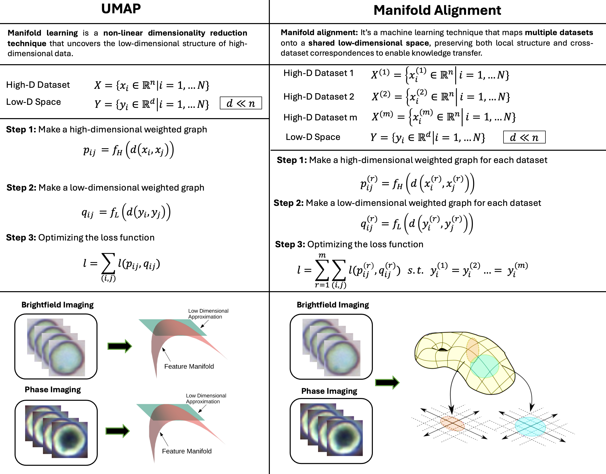
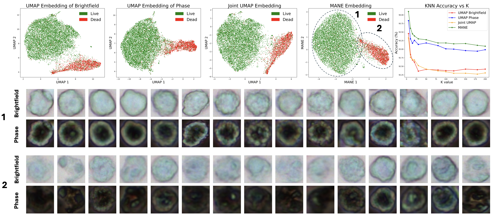

<div align="center">
<h1>Manifold Alignment for Label-Free Cell Phenotyping in Multimodal Microscopy</h1>
<p>
  <a href="https://www.optica.org/events/congress/biophotonics_congress/"></a>
</p>
<p>
  <a href="https://amirrezavazifeh.github.io/">Amir Reza Vazifeh</a><sup>1</sup> &nbsp;·&nbsp;
  <a href="https://ece.princeton.edu/people/jason-w-fleischer">Jason W. Fleischer</a><sup>1,*</sup>
</p>
<p>
  <sup>1</sup> Department of Electrical and Computer Engineering, Princeton University, Princeton, NJ 08544, USA<br>
  <sup>*</sup> jasonf@princeton.edu
</p>
<p><em>Optica Biophotonics Congress</em>, 2026</p>
</div>

---

## Overview

Determining cell viability is a fundamental requirement across biological research, pharmaceutical development, and clinical practice. Conventional approaches rely on fluorescent dyes such as acridine orange (AO) and propidium iodide (PI), followed by fluorescence imaging in which live and dead cells emit signals in distinct channels, enabling their discrimination. Overall viability is then computed as the ratio of live cells to the total number of cells. However, staining protocols are labor-intensive, may perturb normal cellular processes, and are susceptible to photobleaching. 
This work shows that unstained brightfield or phase-contrast images contain sufficient information for viability analysis without any fluorescent labels, and introduces a multimodal unsupervised framework to achieve it.

---

## Motivation

There are doifferent apporaches for solving this problem: 

### Approach 1: Virtual Staining
One natural idea is to train a deep neural network (e.g., a U-Net) to predict fluorescent images directly from transmitted-light images. While promising, this approach has critical limitations:
- Requires large, carefully registered image pairs for supervised training.
- Some cells appear in both fluorescent channels, creating ambiguous labels.
- Ultimately, cell counting should be performed on virtually stained images, as the live-to-total cell ratio is what matters.

### Approach 2: Cell Segmentation + Classification
A more principled pipeline first segments individual cells, then trains a classifier to predict live vs. dead. This avoids full image-to-image mapping and directly targets viability counting. However, supervised classification still has failure modes:
- Intra-class variation amont cells with same lable (like dead) cannot be captured
- Outlies like inaccurate bounding boxes cannot be identified by supervised learning and can affect training procedure.
- Most critically, **no labeled dataset exists for unstained samples** — so if unstained samples do not sufficiently resemble the stained ones, the supervised learning trained on stained sample will not generalize to unstaiend one,

### Approach 3: Unsupervised Dimensionality Reduction
Because of the domain gap between stained and unstained images, an unsupervised approach is more appropriate. Nonlinear dimensionality reduction methods such as UMAP and t-SNE project high-dimensional cell images into a 2D latent space, where live and dead cells naturally form separable clusters with no labels required. This also enables discovery of sub-populations (e.g., morphologically distinct types of dead cells) and outlier detection that supervised methods miss. Standard [UMAP]([https://openreview.net/forum?id=BFIER4-J6xc](https://arxiv.org/abs/1802.03426)) operates on a single modality and must be applied separately to each imaging configuration. Different modalities — brightfield, phase-contrast, different focal planes — each capture complementary cellular information. **[Manifold-Aligned Neighbor Embedding (MANE)](https://openreview.net/forum?id=BFIER4-J6xc)** extends UMAP to jointly embed multiple modalities into a shared low-dimensional space, enforcing that the same cell maps to the same point regardless of which modality it comes from. 

---

## Method

MANE generalizes UMAP to multiple datasets by optimizing a joint cross-entropy loss across all modalities, subject to the constraint that each cell shares a single low-dimensional embedding across modalities:

$$\ell = \sum_{r=1}^{m} \sum_{(i,j)} \ell\!\left(p_{ij}^{(r)}, q_{ij}^{(r)}\right) \quad \text{s.t.} \quad y_i^{(1)} = y_i^{(2)} = \cdots = y_i^{(m)}$$

where $p_{ij}^{(r)}$ and $q_{ij}^{(r)}$ are the high- and low-dimensional pairwise affinities for modality $r$, constructed exactly as in UMAP. The shared embedding constraint forces the model to reconcile complementary information across modalities rather than embedding them independently.

In our experiments, brightfield and phase-contrast RGB images of CHO cells were acquired at multiple focal planes. Individual cells were segmented using [Cellpose](https://www.nature.com/articles/s41592-020-01018-x) and resized to 64×64 pixels, yielding a 12,288-dimensional feature vector per cell per modality. MANE was then applied to produce a joint 2D embedding.

<p align="center">
  
</p>

---

## Results

Following figure illustrates the 2D embeddings generated by UMAP and MANE for our cell viability dataset. When UMAP is applied independently to brightfield and phase-contrast images, both modalities produce embeddings with two primary clusters. Although UMAP effectively captures patterns within each modality, it cannot integrate cross-modal information. In contrast, MANE jointly embeds both brightfield and phase-contrast images into a shared latent space, capturing morphological features across both imaging modalities simultaneously. To quantitatively compare the embeddings, we applied a K-nearest neighbor (KNN) classifier to each 2D embedding. MANE consistently achieves higher classification accuracy across various values of \(k\), demonstrating its ability to generate a more informative representation. Additionally, we visualized 15 representative samples from the two major clusters identified in the MANE embedding: one cluster contains cells with sharp, well-defined boundaries characteristic of live cells, while the other comprises cells with more diffuse edges and fuzzy membranes.

<p align="center">
  
</p>

---

## Repository Structure

```
├── src/
│   ├── mane.py/        # MANE dimensionality reduction
│   └── main.py/        # Applying it on our datase
├── figures/            # Figures
└── README.md
```

---

## Contact

For questions or issues, please contact [amir.vazifeh@princeton.edu](mailto:amir.vazifeh@princeton.edu).

---

## Citation

To be a4dded!
